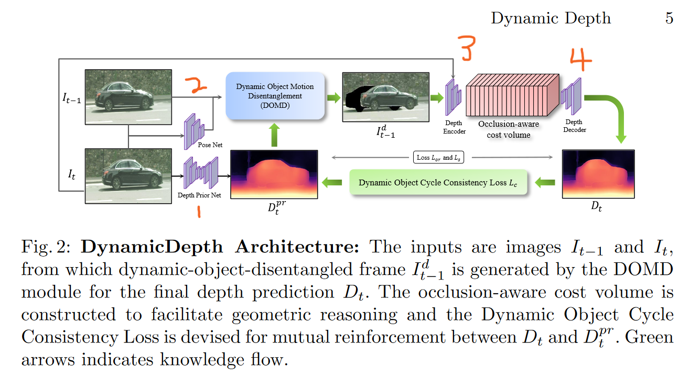

# Whole process

# Init Trainer()

## Set up some parameters

1. `self.opt.scales = [0, 1, 2, 3]` define the distinct structures of `depthDecoder` 
2. `self.opt.frame_id = [0, -1, 1]` define which frames to use, i.e $I_t, I_{t-1}, I_{t+1}$

## Load networks

1. `"encoder"`  → part 3
2. `"depth"` → part 4
3. `"mono_encoder", "mono_depth"` → part 1
4. `"pose_encoder", "pose"` → part 2

## Prepare dataset

1. `CityscapesPreprocessedDataset` for training, `CityscapesEvalDataset` for eval
2. Take a look at `__get_item__` in [mono_dataset.py](./dynamicdepth/datasets/mono_dataset.py)

## 3D-point and pixel-point

1. `BackprojectDepth` = 2D → 3D; `Project3D` = 3D → 2D

## Metrics

1. `self.depth_metric_names = ["de/abs_rel", "de/sq_rel", "de/rms", "de/log_rms", "da/a1", "da/a2", "da/a3"]`

# trainer.train()

## Set parameters

1. `epoch` = 1 ... thus `freeze_teacher()` will never be called

## run_epoch()

1. `process_batch()`
2. ``