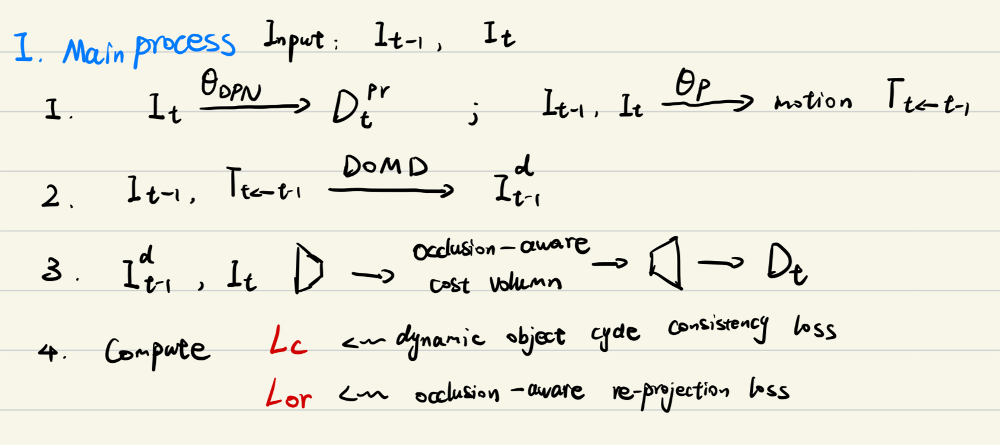

# Whole process
整个代码细节要搞清楚感觉不太容易，我这边大致理清楚了一些步骤

# Init Trainer()

## Set up some parameters

1. `self.opt.scales = [0, 1, 2, 3]` define the distinct structures of `depthDecoder` 
2. `self.opt.frame_id = [0, -1, 1]` define which frames to use, i.e $I_t, I_{t-1}, I_{t+1}$

## Load networks

1. `"encoder"`  → part 3
2. `"depth"` → part 4
3. `"mono_encoder", "mono_depth"` → part 1
4. `"pose_encoder", "pose"` → part 2

## Prepare dataset

1. `CityscapesPreprocessedDataset` for training, `CityscapesEvalDataset` for eval
2. Take a look at `__get_item__` in [mono_dataset.py](./dynamicdepth/datasets/mono_dataset.py)
    1. Input images of scale 0 are in shape (3, 192, 512)

## 3D-point and pixel-point

1. `BackprojectDepth` = 2D → 3D; `Project3D` = 3D → 2D

## Metrics

1. `self.depth_metric_names = ["de/abs_rel", "de/sq_rel", "de/rms", "de/log_rms", "da/a1", "da/a2", "da/a3"]`

# trainer.train()

## Set parameters

1. `epoch` = 1 ... thus `freeze_teacher()`(only train cost volumn phase) will never be called

## val()
If we use pretrained model, we will first evaluate the results.

## run_epoch()

### process_batch()

1. `predict_poses()`, to compute the relative poses
2. The sys uses `color_aug` images as inference images($I_{t-1}$)
3. send $I_{t-1}$ to network 1 and obtain disparity
4. `forward_warp()` to obtain warpped images.
5. Encode and obtain the re-projected images

# 关于 Cost Volume and Loss
我个人的理解是cost volume 就是用来找匹配点的，我们就用author给的算法好了。
然后作者提出的`Occlusion-aware Re-projection Loss` 本质上也就是避免occlusion影响区域的loss梯度反传造成网络学到脏东西，这个也是可以直接使用的。
## what can we do then?
1. 或许我们要质疑一下它的整个学习流程，就是teacher那一部分
2. 增加几何约束。